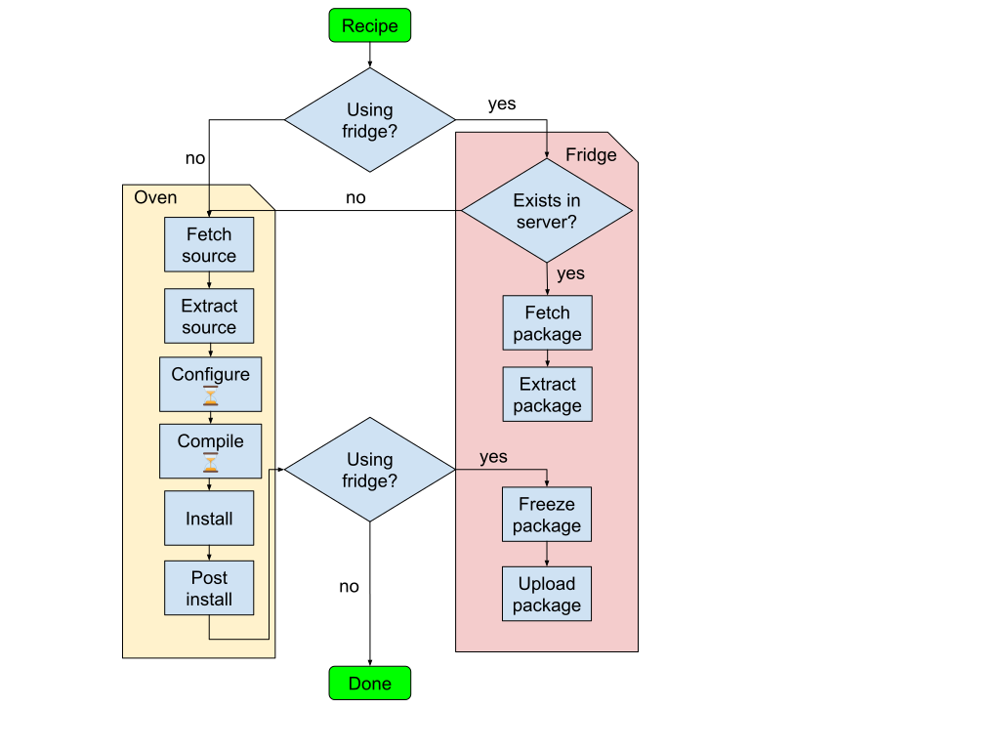

# Fridge

The fridge functionality of Cerbero aims to reduce the time taken to cook
recipes by freezing them once they are built and uploading their content to some
FTP server that acts as a fridge for the recipes. This way, we avoid the
configure and compile steps, which are arguably the most time-consuming ones.

## Diagram



## How recipes are reused

A hash is generated for the current environment used in the configuration. This
means everything that `config::get_env` considers. e.g. the linker flags,
include dir, LD_LIBRARY_PATH, etc. Hence, the idea is to reuse the same
binaries already built in a conservative way to ensure they will work. The
environment is sanitized before creating the hash, so that the prefix,
Cerbero's home and user's home are normalized. Apart from that, the package
naming already contains the target platform and target architecture. A
directory is created for each of the configurations (aka. environments) where
prebuilt packages will live.

Apart from the environment hash, a hash is generated per recipe to allow having
different versions. The recipe hash is taken from a checksum of all the files
involving it (the recipe itself + patches), the version that it's using and in
case `strict_recipe_checksum` is set to True, also all its parent classes and
dependencies checksums. For recipes using a git repo as its source, their
version includes the commit it's based upon.

This is a comprehensive list that shows the changes that affect the package
name:

* The recipe content
* The commit hash a recipe is pointing to
* Any of the patches' content, or a new one is added
* Any of the values of the variants
* If `strict_recipe_checksum=True`
  * Any of the non-builtin parent's classes of the recipe
  * Any of the recipe dependencies

# What is packaged

Initially, we had a *devel* and *release* version of each package and fridge was
using the same files that are specified in the recipes that need to be packaged.
It turned out to be very troublesome and difficult to maintain a list of files
needed for each recipe that is used during the bootstrap step for each OS. As a
consequence, a pragmatic approach was taken in which we only have *devel*
packages for each recipe which includes every single file that is actually
installed. This way, we ensure that what's packaged has everything needed. The
source code is prepared to switch to the *devel* + *release* flavours at any
point, though.

The installed files collection is done by gathering all the files that *install*
and *post_install* add or modify. This list of files is added to the cache into
a new `installed_files` member. This may be used in the future not only to know
which files fridge needs to package, but also to fully uninstall all the files a
recipe has added.

## How recipes are stored in the fridge

The fridge consists of a FTP server with write permissions granted so that the
client can create a different directory per configuration. This directory will
contain all the packages built for this specific configuration for all target
platforms and target architectures.

Every frozen recipe is uploaded along a sha256 files containing the hash of the
packages file. This file will be used on the local fridge to know whether the
remote one needs to be downloaded or not. In other words, the `binaries_local`
directory specified in the config acts as a local cache for the frozen recipes.

Additionally, every environment directory includes an `ENVIRONMENT` file
containing the list of all the variables considered to generate the hash:

```
73f25829

ACLOCAL=aclocal
ACLOCAL_FLAGS=-I{PREFIX}/share/aclocal
ARCH=x86_64
CC=gcc
CERBERO_VARIANTS=<Variants: {'debug': True, 'python': True, 'testspackage': True, 'x11': True, 'alsa': True, 'pulse': True, 'cdparanoia': False, 'v4l2': True, 'gi': True, 'unwind': True, 'rpi': False, 'visualstudio': False, 'qt5': False, 'intelmsdk': False, 'nvcodec': False, 'werror': False, 'gst1': False, 'sdl': False, 'clutter': False, 'gtk': False, 'strip': True, 'ffmpeg_enabler_demo': False, 'static': True, 'va': True}>
CFLAGS=-Wall -g -O2 -m64 -Wall -g -O2 -m64
CPLUS_INCLUDE_PATH={PREFIX}/include
C_INCLUDE_PATH={PREFIX}/include
DISTRO=debian
DISTRO_VERSION=ubuntu_20_04_focal
GI_TYPELIB_PATH={PREFIX}/lib/girepository-1.0
GSTREAMER_ROOT={PREFIX}
GST_PLUGIN_PATH={PREFIX}/lib/gstreamer-0.10
GST_PLUGIN_PATH_1_0={PREFIX}/lib/gstreamer-1.0
GST_REGISTRY={USER}/.gstreamer-0.10/cerbero-registry-x86_64
GST_REGISTRY_1_0={USER}/.cache/gstreamer-1.0/cerbero-registry-x86_64
INFOPATH={PREFIX}/share/info
LDFLAGS=-L{PREFIX}/lib -m64 -m64
LD_LIBRARY_PATH={PREFIX}/lib:{HOME}/build-tools/lib
MANPATH={PREFIX}/share/man
MONO_GAC_PREFIX={PREFIX}
MONO_PATH={PREFIX}/lib/mono/4.5
PERL5LIB={PREFIX}/lib/perl5:{PREFIX}/lib/perl5/site_perl/5.32.1
PKG_CONFIG={HOME}/build-tools/bin/pkg-config
PKG_CONFIG_LIBDIR={PREFIX}/lib/pkgconfig
PKG_CONFIG_PATH={PREFIX}/share/pkgconfig
PLATFORM=linux
PYTHONPATH={PREFIX}/lib/python3.9/site-packages/:{HOME}/build-tools/lib/python3.9/site-packages/
TARGET_ARCH=x86_64
TARGET_DISTRO=debian
TARGET_DISTRO_VERSION=ubuntu_20_04_focal
TARGET_PLATFORM=linux
XCURSOR_PATH={PREFIX}/share/icons
XDG_CONFIG_DIRS={PREFIX}/etc/xdg
XDG_DATA_DIRS={PREFIX}/share:/usr/share:/usr/local/share
```

The following directory contains the packages of yasm and zlib recipes for macOS
64bit, along with their sha256:

```
└── ffdfa03d
    ├── ENVIRONMENT
    ├── yasm-pkg-darwin-x86_64-1.3.0-aa98cab1-devel.tar.bz2
    ├── yasm-pkg-darwin-x86_64-1.3.0-aa98cab1-devel.tar.bz2.sha256
    ├── zlib-pkg-darwin-x86_64-1.2.11-dffcadaf-devel.tar.bz2
    ├── zlib-pkg-darwin-x86_64-1.2.11-dffcadaf-devel.tar.bz2.sha256
```

## How to use the fridge functionality

First, we need add the `binaries_remote` element into the configuration. e.g.:
`binaries_remote = FtpBinaryRemote('127.0.0.1:2121')`.

Apart from that, the following arguments have been added to the `build` and
`bootstrap` commands:

```
--use-binaries     use binaries from the repo before building
--upload-binaries  after a recipe is built upload the corresponding binary package
--fridge           equivalent to '--use-binaries --upload-binaries'
```

As a rule of thumb, if you want to use prebuilt binaries and upload any of them
that are not already present, you would use `--fridge`. Cerbero will
automatically use the ones that exist but build the ones who doesn't, uploading
them to the fridge if the option is given.

## How to test that fridge works correctly

The easiest way to test fridge is using a local FTP server. The one I use is
pyftpdlib:

```bash
pip3 install pyftpdlib
mkdir -p /tmp/fridge
python3 -m pyftpdlib -i localhost -d /tmp -w
```

In `recipes-test` there is a cbc already prepared to work against a local FTP.
It also provides 4 different test recipes used for the following tests. They do
not require to bootstrap and all clone the same repo, but at different commits
if needed:

* test  - has no dependencies
* test2 - same as test but pointing to different commit
* test3 - depends on test and test2. It cannot be frozen. Thus, it is always built and no fridge package is ever generated for it
* test4 - depends on test3

There's a number of edge cases that need to be tested to ensure fridge is
working correctly. They need to be run in order, because the next one expects
the status the previous step left:

* Fridge packages can be uploaded. Expected: `upload_binary` steps should run
  and the /tmp/fridge should have 3 packages: for test, test2 and test4

```bash
rm -rf /tmp/fridge/*; rm -rf /opt/cerbero-test && ./cerbero-uninstalled -t -c test.cbc build test4 --upload-binaries
tree -hD /tmp/fridge
```

* Fridge packages can be used. Expected: `fetch_binary` and `extract_binary`
  steps should run and only test3 should run configure and compile steps

```bash
rm -rf /opt/cerbero-test && ./cerbero-uninstalled -t -c test.cbc build test4 --use-binaries
```

* Fridge packages can be generated if they were previously built. Expected:
  recipes are built from scratch in first command and `upload_binary` is shown
  in second command, skipping building steps since they were done previously

```bash
rm -rf /tmp/fridge/*; rm -rf /opt/cerbero-test && ./cerbero-uninstalled -t -c test.cbc build test4
./cerbero-uninstalled -t -c test.cbc build test4 --upload-binaries
tree -hD /tmp/fridge
```

* buildone command forces a rebuild of the recipe. Expected: only test4 is
  built from scratch

```bash
./cerbero-uninstalled -t -c test.cbc buildone test4
```

* Fridge with buildone command forces a rebuild of the recipe, uploading the
  binaries. Expected: only test4 is built from scratch and `upload_binary` step
  is executed

```bash
./cerbero-uninstalled -t -c test.cbc buildone test4 --upload-binaries
```

* Fridge with buildone command forces a rebuild of the recipe, fetching the binaries. Expected: only
  test4 recipe runs `fetch_binary` and `extract_binary` steps:

```bash
./cerbero-uninstalled -t -c test.cbc buildone test4 --use-binaries
```

* Modifying a recipe changes its checksum, generating a new fridge package.
  Expected: test4 is reset and built from scratch. Then, it's restored and
  fetched from fridge

```bash
echo "# dummy comment" >> recipes-test/test4.recipe
./cerbero-uninstalled -t -c test.cbc build test4 --fridge
echo "Restoring and fetching original test4.recipe..."
content=$(head recipes-test/test4.recipe -n -1)
echo "$content" > recipes-test/test4.recipe
./cerbero-uninstalled -t -c test.cbc build test4 --fridge
tree -hD /tmp/fridge
```

* Modifying a dependency changes the name of both that recipe and all its
  dependents. Expected: test2 is reset and built from scratch, along with test3
  and test4. Then, test2 is restored and along with test3 and test4 are fetched
  from fridge

```bash
echo "# dummy comment" >> recipes-test/test2.recipe
./cerbero-uninstalled -t -c test.cbc build test4 --fridge
tree -hD /tmp/fridge
echo "Restoring and fetching original test2.recipe..."
content=$(head recipes-test/test2.recipe -n -1)
echo "$content" > recipes-test/test2.recipe
./cerbero-uninstalled -t -c test.cbc build test4 --fridge
tree -hD /tmp/fridge
```

* If a package is not available, recipe is built from scratch as a fallback.
  Expected: test4 is rebuilt and uploaded

```bash
rm -rf /tmp/fridge/*/test4* && rm -rf /opt/cerbero-test && ./cerbero-uninstalled -t -c test.cbc build test4 --use-binaries
./cerbero-uninstalled -t -c test.cbc build test4 --fridge
tree -hD /tmp/fridge
```

* If a package in fridge does not match the checksum, recipe is built from
  scratch. Expected: test4 is rebuilt and uploaded

```bash
echo "1234 1234" > /tmp/fridge/*/test4*.tar.bz2.sha256
cat /tmp/fridge/*/test4*.tar.bz2.sha256
rm -rf /opt/cerbero-test && ./cerbero-uninstalled -t -c test.cbc build test4 --fridge
cat /tmp/fridge/*/test4*.tar.bz2.sha256
tree -hD /tmp/fridge
```

* If a package in fridge is corrupted, recipe is built from scratch. Expected:
  test4 is built from scratch because `extract_binary` fails

```bash
file=$(find /tmp/fridge -iname "test4*.tar.bz2")
dd if=$file count=100 bs=1 of=/tmp/tmp_package.tar.bz2
cp /tmp/tmp_package.tar.bz2 $file
sha256sum $file > $file.sha256
rm -rf /opt/cerbero-test && ./cerbero-uninstalled -t -c test.cbc build test4 --fridge
```

* If a package in local cache is corrupted, recipe is fetched again. Expected:
  test4 is uninstalled, fetched and installed again

```bash
file=$(find /opt/cerbero-test/binaries -iname "test4*.tar.bz2")
dd if=$file count=100 bs=1 of=/tmp/tmp_package.tar.bz2
cp /tmp/tmp_package.tar.bz2 $file
sha256sum $file > $file.sha256
./cerbero-uninstalled -t -c test.cbc uninstall test4
tree -hD /opt/cerbero-test/binaries
./cerbero-uninstalled -t -c test.cbc build test4 --use-binaries
tree -hD /opt/cerbero-test/binaries
```

* Packages can be fetched from fridge. Expected: `fetch_binary` step runs
  successfully for test, test2 and test4

```bash
rm -rf /opt/cerbero-test && ./cerbero-uninstalled -t -c test.cbc fetch test4 --use-binaries
tree -hD /opt/cerbero-test/binaries
```

* If missing package in fridge, sources are fetched as a fallback. Expected:
  `fetch_binary` for test fails, thus its source is downloaded instead

```bash
rm -rf /tmp/fridge/*/test-*; rm -rf /opt/cerbero-test && ./cerbero-uninstalled -t -c test.cbc fetch test --use-binaries
tree -hD /opt/cerbero-test/binaries && tree -hD /opt/cerbero-test/sources/local
```
